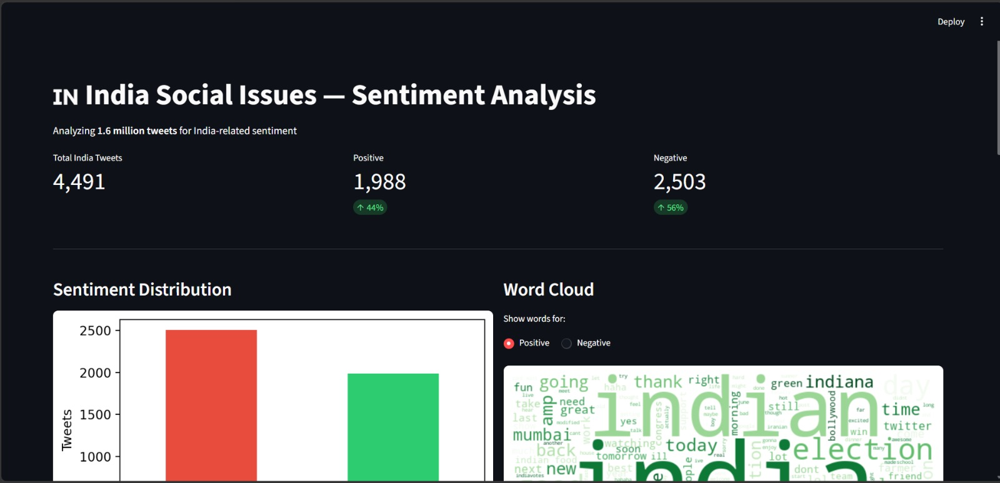
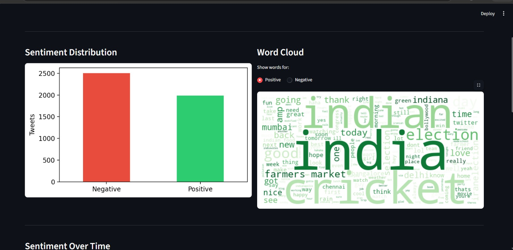
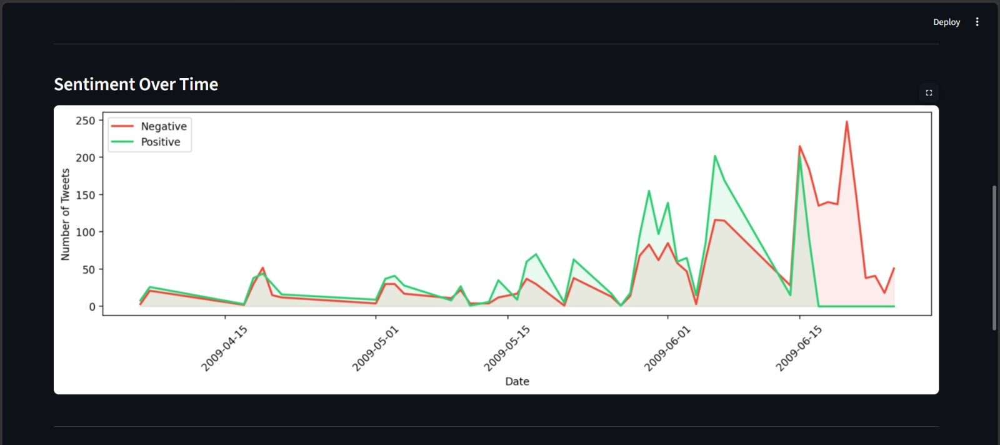
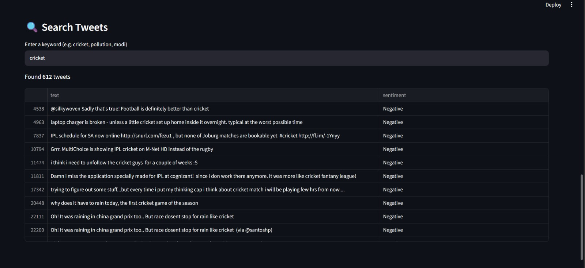

# 🇮🇳 India Social Issues — Sentiment Analysis

A end-to-end NLP project analyzing **1.6 million tweets** to understand 
public sentiment around Indian social issues like cricket, elections, 
pollution, farmers, and more.

## 📊 Dashboard Preview






## 🔍 What This Project Does
- Filters 1.6M tweets for India-related keywords
- Cleans and preprocesses text (removes URLs, mentions, stopwords)
- Classifies tweets as **Positive** or **Negative**
- Visualizes sentiment distribution, word clouds, and time trends
- Interactive dashboard with live keyword search

## 📈 Key Findings
- Analyzed **4,491** India-related tweets
- **56% Negative** and **44% Positive** sentiment overall
- Tweet activity peaked in **June 2009**
- Top topics: cricket, elections, farmers market, mumbai, chennai

## 🛠️ Tech Stack
| Tool | Purpose |
|------|---------|
| Python | Core language |
| Pandas | Data manipulation |
| NLTK | Text preprocessing |
| Matplotlib | Charts and graphs |
| WordCloud | Word cloud visualization |
| Streamlit | Interactive dashboard |

## 📁 Project Structure
├── app.py                  # Streamlit dashboard
├── analysis.ipynb          # Jupyter notebook with full analysis
├── sentiment_distribution.png
├── sentiment_over_time.png
├── wordcloud_positive.png
├── wordcloud_negative.png
└── .gitignore

## 🚀 How to Run

1. Clone the repo
```bash
git clone https://github.com/paruuup/Tweet-sentiment-analysis.git
```

2. Install dependencies
```bash
pip install pandas nltk matplotlib wordcloud streamlit
```

3. Download the dataset from Kaggle
[Sentiment140 Dataset](https://www.kaggle.com/datasets/kazanova/sentiment140)

4. Run the dashboard
```bash
streamlit run app.py
```

## 📬 Contact
Made by **paruuup** — feel free to connect on LinkedIn!
